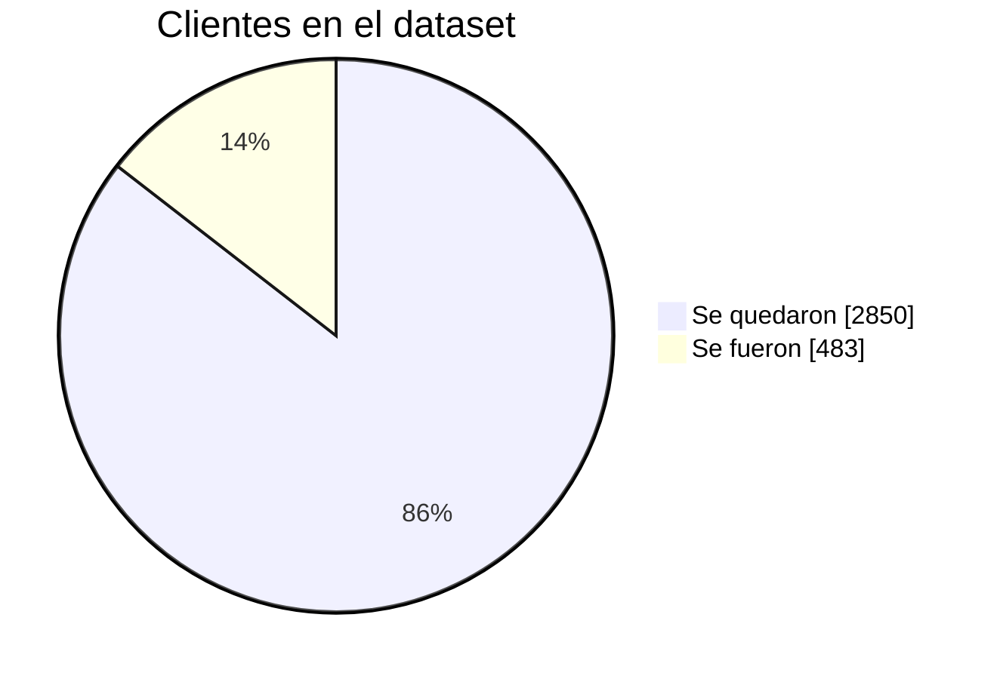
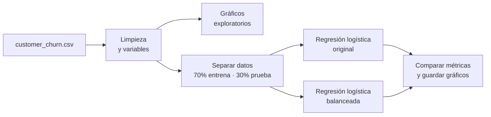
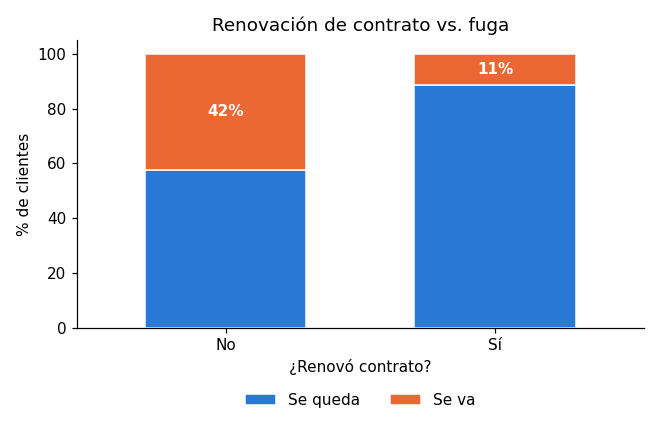
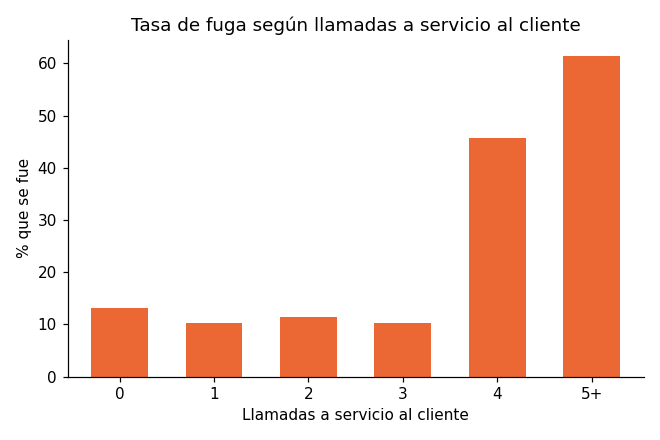
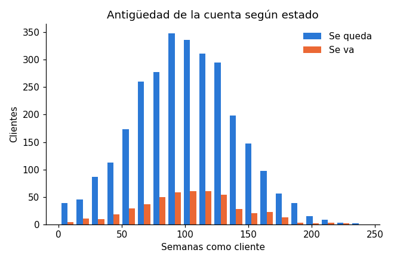
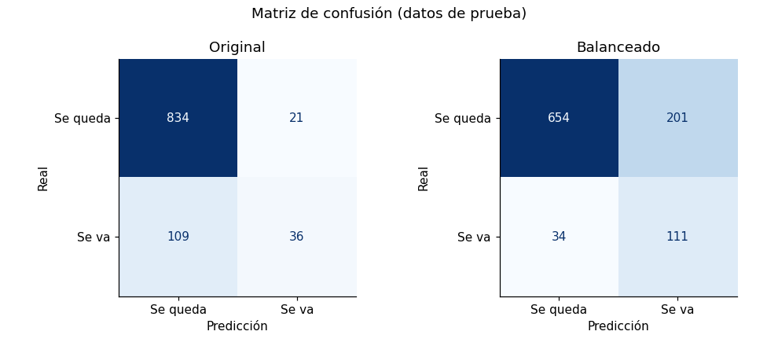
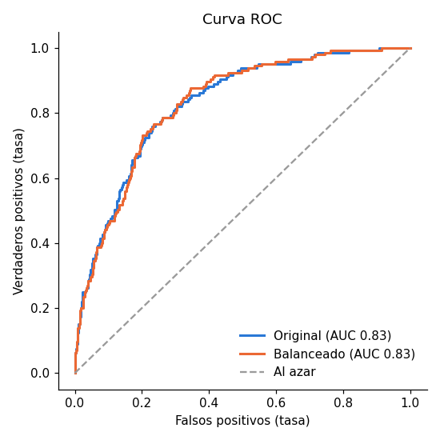
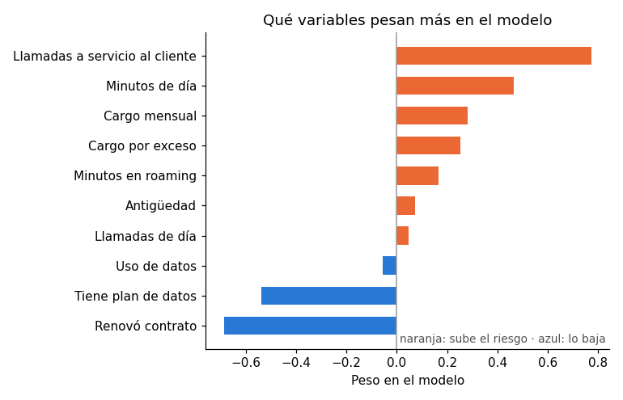

# Predicción de fuga de clientes (Customer Churn)

Proyecto hecho durante el **Microsoft Python Development Professional Certificate** (Coursera). A partir de los datos de 3,333 clientes de una empresa de telecomunicaciones, el modelo estima qué clientes tienen más riesgo de irse, para que la empresa pueda contactarlos antes de que lo hagan.

## Los datos

Cada fila es un cliente: cuántas semanas lleva, si renovó su contrato, si tiene plan de datos, cuántos minutos habla de día, cuánto paga al mes, cuántas veces llamó a servicio al cliente, entre otras cosas. La columna `Churn` indica si se fue (1) o no (0).



Solo el 14.5 % de los clientes se fue. Este detalle es clave para evaluar el modelo, como se ve más abajo.

## Qué hace el script



## Lo que se ve en los datos

**Los que no renuevan contrato se van mucho más.** El 42 % de los clientes sin renovación se fue, contra el 11 % de los que sí renovaron.



**Llamar mucho a servicio al cliente es la señal más fuerte.** Hasta 3 llamadas, la fuga se mantiene cerca del 11 %. Con 4 llamadas o más, se va más de la mitad (52 %). Probablemente es un cliente con un problema que no se le resolvió.



**La antigüedad casi no influye.** Los que se van y los que se quedan tienen distribuciones parecidas.



## Resultados del modelo

La primera versión del curso reportaba solo *accuracy* (qué porcentaje de clientes clasifica bien). El problema es que como casi todos se quedan, un modelo que dijera "nadie se va" ya acertaría el **85.5 %** sin aprender nada. Por eso revisé también cuántos de los clientes que sí se fueron logra detectar el modelo (*recall*).

| Modelo | Accuracy | Detecta a los que se van (recall) | Precisión al marcar "se va" | F1 | ROC-AUC |
|---|---|---|---|---|---|
| Decir siempre "se queda" | 0.855 | 0.000 | – | – | – |
| Original | 0.870 | 0.248 | 0.632 | 0.356 | 0.828 |
| Balanceado | 0.765 | **0.766** | 0.356 | **0.486** | 0.829 |



- **El modelo original** tiene buen accuracy, pero de 145 clientes que se fueron solo detecta 36. Para retener clientes, eso sirve poco.
- **El modelo balanceado** (`class_weight="balanced"`) le da más peso a los clientes que se van durante el entrenamiento. Detecta 111 de 145, a cambio de más falsas alarmas: marca a 201 clientes que en realidad se iban a quedar.

Cuál conviene depende del negocio. Si llamar o dar un descuento a un cliente es barato comparado con perderlo, el balanceado es mucho más útil. Ambos separan igual de bien a los que se van de los que se quedan (AUC de 0.83); lo que cambia es dónde se pone el corte.



## Qué variables pesan más



Las llamadas a servicio al cliente y los minutos de uso de día son lo que más sube el riesgo. Renovar contrato y tener plan de datos lo bajan. Algunas variables están relacionadas entre sí (el cargo mensual depende del uso), así que estos pesos sirven para ver tendencias, no como una medida exacta de cada una.

## Cómo correrlo

```bash
pip install -r requirements.txt
python analisis_riesgo.py
```

Imprime las métricas en la consola y guarda los gráficos en `docs/`.

## Archivos

- `analisis_riesgo.py`: carga, limpieza, gráficos, entrenamiento y evaluación.
- `customer_churn.csv`: dataset del curso.
- `docs/`: gráficos generados por el script.

## Tecnologías

Python, Pandas, Scikit-learn y Matplotlib.
